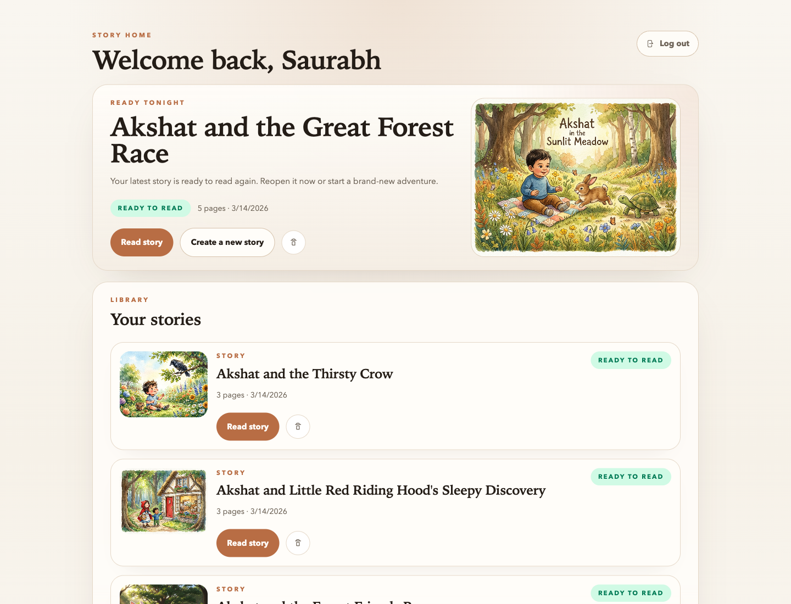
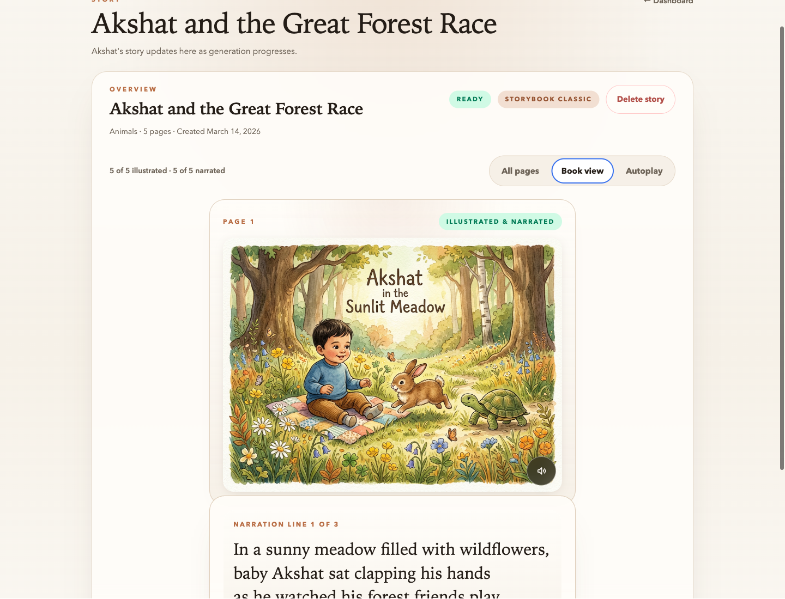
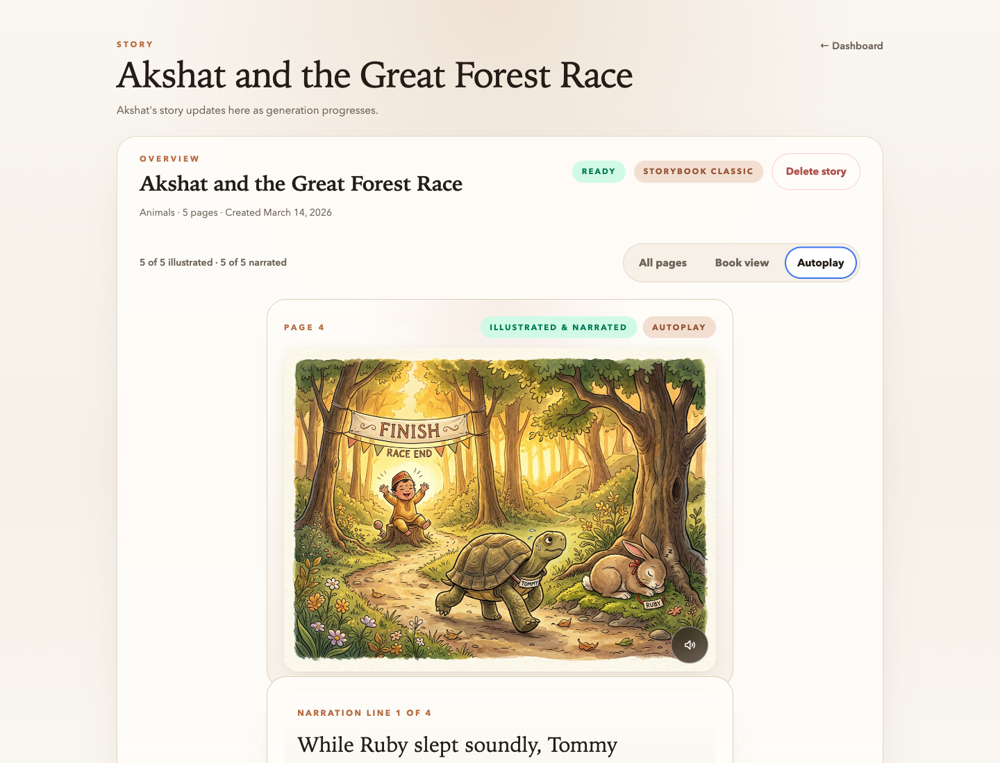
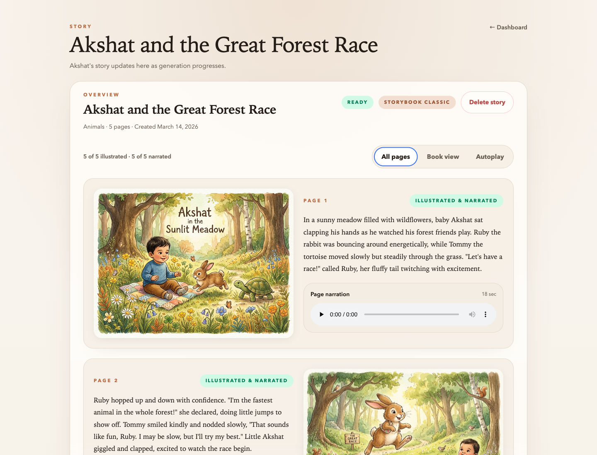

# 🍃 Vocaleaf

**AI-powered personalized storybooks narrated in a parent's own voice**

[](https://python.org)
[](https://vuejs.org)
[](https://fastapi.tiangolo.com)
[](https://postgresql.org)

Vocaleaf generates personalized children's storybooks with AI-written text, unique illustrations for every page, and narration in a cloned parent's voice. Upload a few voice samples, describe a story, and Vocaleaf handles the rest — producing a complete, narrated picture book ready for bedtime.

---

## 🎬 Demo

Demo video of the app

https://github.com/user-attachments/assets/04c57812-82d0-4f03-bd2b-fefee297265c

---

## 📸 Screenshots

<table>
  <tr>
    <td align="center"><strong>Dashboard</strong></td>
    <td align="center"><strong>Story Creation</strong></td>
    <td align="center"><strong>Book View</strong></td>
  </tr>
  <tr>
    <td></td>
    <td></td>
    <td></td>
  </tr>
  <tr>
    <td align="center"><strong>Autoplay Mode</strong></td>
    <td align="center"><strong>Voice Cloning</strong></td>
    <td align="center"><strong>Pages Gallery</strong></td>
  </tr>
  <tr>
    <td></td>
    <td></td>
    <td></td>
  </tr>
</table>

<!-- To make the video work on GitHub: open an issue, drag-drop artifacts/Vocaleaf.mp4 into the comment box,
     copy the generated URL (https://github.com/user-attachments/assets/...), and replace the URL above. -->

---

## ✨ Features

- 📖 **AI Story Generation** — Claude writes personalized, page-by-page stories tailored to your child
- 🎨 **AI Illustrations** — Google Gemini generates unique artwork for every page
- 🎙️ **Voice Cloning** — Clone a parent's voice from short audio samples via ElevenLabs
- 🔊 **Narrated Playback** — Stories read aloud in the cloned voice with line-by-line text reveal
- 📱 **Mobile-First Design** — Warm, editorial UI optimized for bedtime reading
- 👶 **Child Profiles** — Personalized stories tailored to each child's name and interests
- 🔐 **Secure Auth** — Email/password + Google OAuth with JWT cookies
- ☁️ **Private Storage** — All media in private Cloudflare R2 buckets with signed URLs

---

## 🛠️ Tech Stack

| Layer | Technology |
|---|---|
| Backend | FastAPI, SQLAlchemy 2.0, Alembic, Celery |
| Frontend | Vue 3, TypeScript, Vite, Pinia, Tailwind CSS |
| Database | PostgreSQL 16 |
| Queue | Redis 7 + Celery |
| Storage | Cloudflare R2 (S3-compatible) |
| AI — Text | Anthropic Claude |
| AI — Images | Google Gemini |
| AI — Voice | ElevenLabs |
| Auth | JWT + Argon2id |

---

## 🚀 Quick Start

**Prerequisites:** Docker, Python 3.12+, Node 18+, [uv](https://docs.astral.sh/uv/)

```bash
# Start Postgres + Redis
docker compose up -d

# Backend (terminal 1)
cd backend
cp .env.example .env          # Add your API keys: ANTHROPIC_API_KEY, GOOGLE_GENAI_API_KEY, ELEVENLABS_API_KEY
uv sync
uv run alembic upgrade head
uv run uvicorn app.main:app --reload --reload-dir app --reload-exclude '.venv/*'

# Frontend (terminal 2)
cd frontend
npm install
npm run dev

# Celery worker (terminal 3, needed for generation)
cd backend
uv run celery -A app.tasks.celery_app worker --loglevel=info
```

Open **http://localhost:5173** and create an account to get started.

---

## 🧪 Tests

```bash
# Backend — 134 tests
cd backend && uv run pytest

# Frontend — 76 tests
cd frontend && npm run test:unit -- --run
```

---

## 📁 Project Structure

```text
backend/
  app/
    api/           # FastAPI route handlers
    core/          # Config, settings
    db/            # Async SQLAlchemy session
    models/        # ORM models (17 models, 12 enums)
    schemas/       # Pydantic request/response models
    services/      # Business logic
    integrations/  # External provider wrappers (ElevenLabs, Gemini, R2)
    workers/       # Celery task implementations
    tasks/         # Celery app config
  alembic/         # DB migrations
  tests/

frontend/
  src/
    views/         # Page-level Vue components
    components/    # Reusable Vue components
    composables/   # Vue composables
    stores/        # Pinia state stores
    services/      # API client functions
    router/        # Vue Router config

docs/              # Architecture and design docs
```

---

## 📚 Documentation

- [Architecture](docs/architecture.md) — System design, module ownership, request flows
- [Schema](docs/schema.md) — Full ER model, all tables and relationships
- [Auth](docs/auth.md) — User vs auth identity split, OAuth, session strategy
- [Storage](docs/storage.md) — Asset model, signed URLs, sensitivity tiers
- [Voice](docs/voice.md) — Voice cloning lifecycle
- [Story Generation](docs/story-generation.md) — Text, image, and audio pipeline
- [Build Plan](docs/plans/2026-03-11-build-plan.md) — Full 15-phase build plan

---

## 🗺️ Roadmap

- Consent & audit logging
- Subscriptions & usage tracking
- Voice deletion & preview samples

---

<p align="center">Built with ❤️ for bedtime stories</p>
