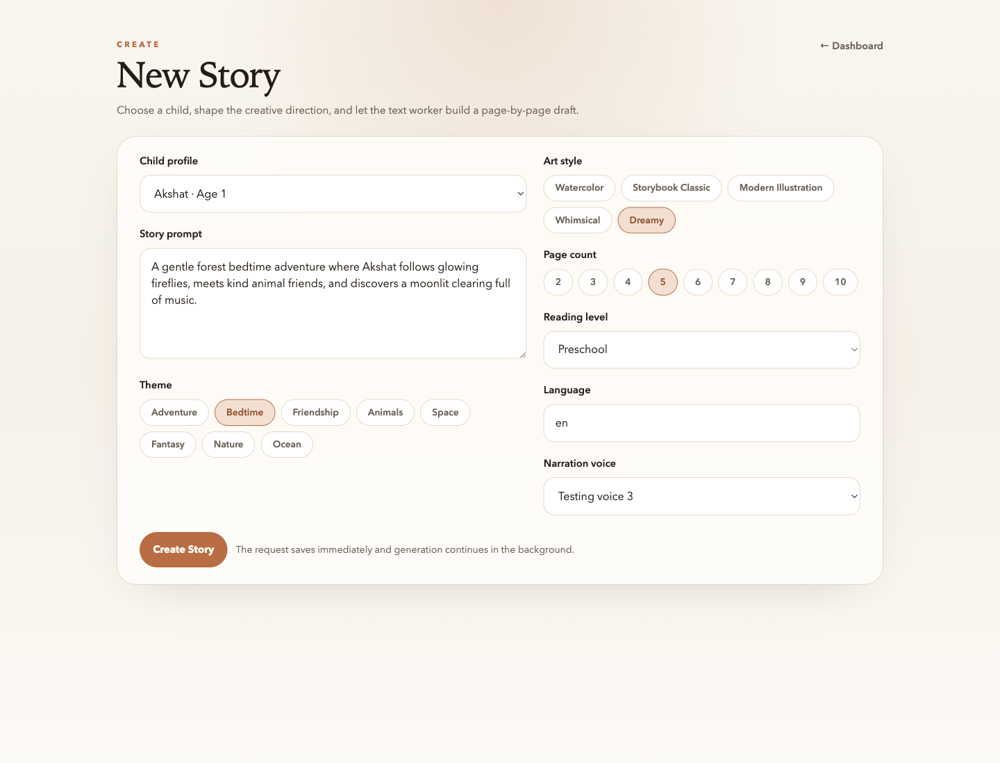
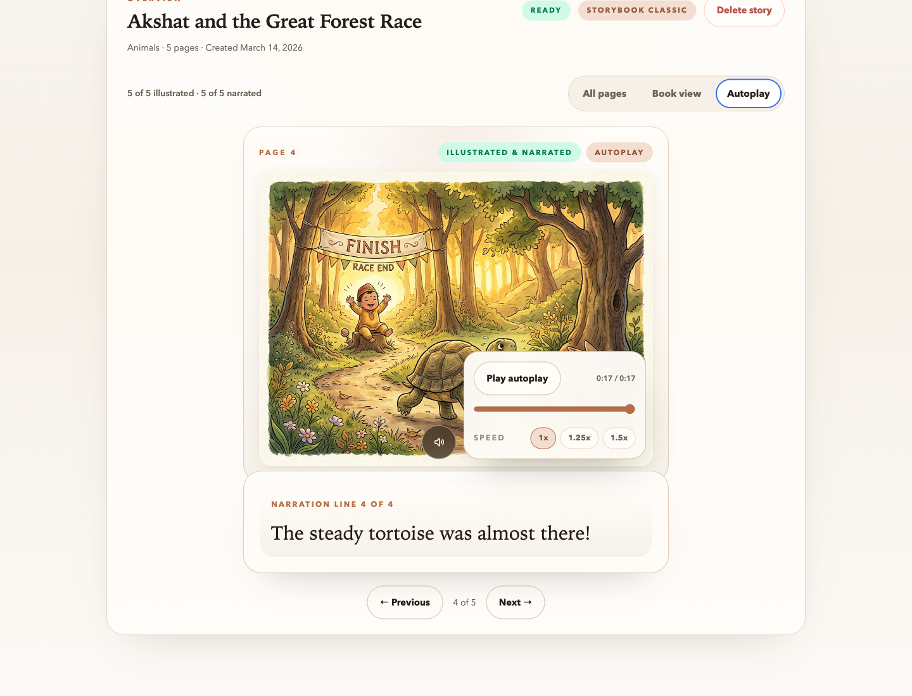

[Product Tour](Product-Tour) | [Technical Approach](Technical-Approach) | [Privacy and Trust](Privacy-and-Trust)

# Vocaleaf

**Stories that sound like home.**

Vocaleaf is a personalized children's storybook app that lets a parent create stories for a child, generate custom illustrations, and optionally narrate each page in a cloned parent voice. The experience is designed to feel simple on the surface while keeping the underlying system private, structured, and resilient.

## Why it stands out

| Product value | What it means in practice |
| --- | --- |
| Personalized from the start | Stories are shaped around a child's profile, themes, reading level, art style, and prompt direction. |
| Narration that feels familiar | Parents can create a reusable narration voice and attach it to new stories once cloning is ready. |
| Calm, easy workflow | The app saves the request immediately, runs generation in the background, and returns a clean reading experience when pages are ready. |
| Private by default | Raw voice samples and generated media stay behind authenticated access and short-lived signed URLs. |

## How it works

1. Create a child profile with age and preferences.
2. Add a narration voice profile and upload a few clean samples.
3. Generate a story with custom prompt, style, page count, and language.
4. Read it in all-pages view, book view, or narration-led autoplay.

## A product built around bedtime usability

The product flow is intentionally direct: sign in, choose a child, shape the story, and let the background workers handle the long-running generation. The result is a story library that feels more like a reading app than a prompt console.

## What exists today

- Parent accounts with email/password auth and Google sign-in
- Child profile management with ownership isolation
- Story creation with prompt, themes, art style, page count, language, and optional narration voice
- Structured page-by-page story generation
- AI-generated illustrations for each page
- Per-page narration audio for voice-enabled stories
- Reader modes for all pages, book view, and autoplay playback
- Private asset storage with signed upload and read access

## Built with a deliberate technical approach

Vocaleaf uses a Vue 3 frontend, a FastAPI backend, Celery workers for long-running AI tasks, PostgreSQL for state, Redis for queueing, and S3-compatible object storage for media. The architecture is designed to keep API requests fast while generation work runs asynchronously and can be retried page by page.

## Explore the project

- [Product Tour](Product-Tour)
- [Technical Approach](Technical-Approach)
- [Privacy and Trust](Privacy-and-Trust)
- See the main repository README for local setup and development commands when you publish the wiki alongside the repo.
