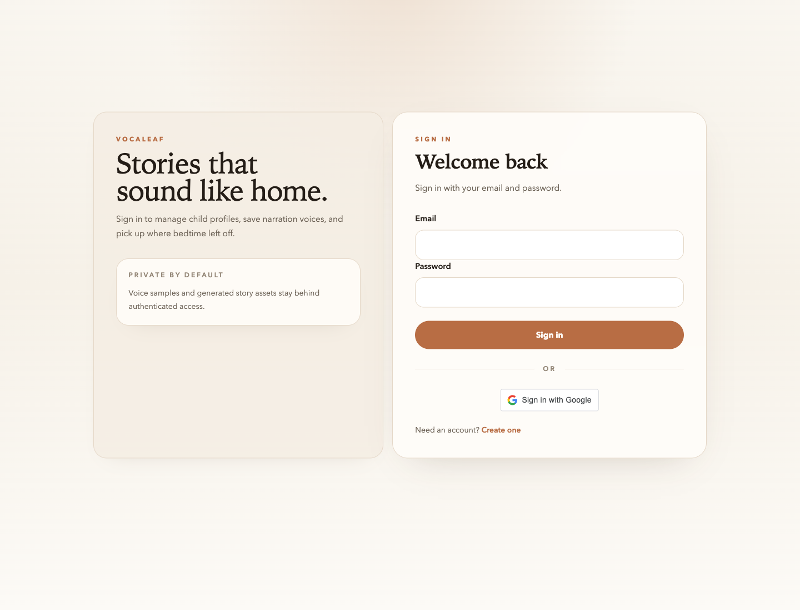
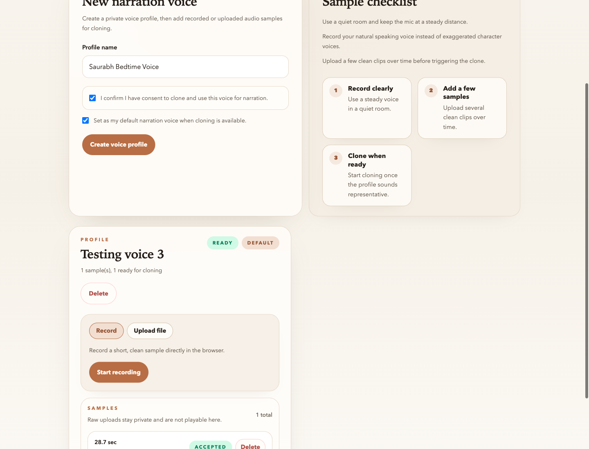
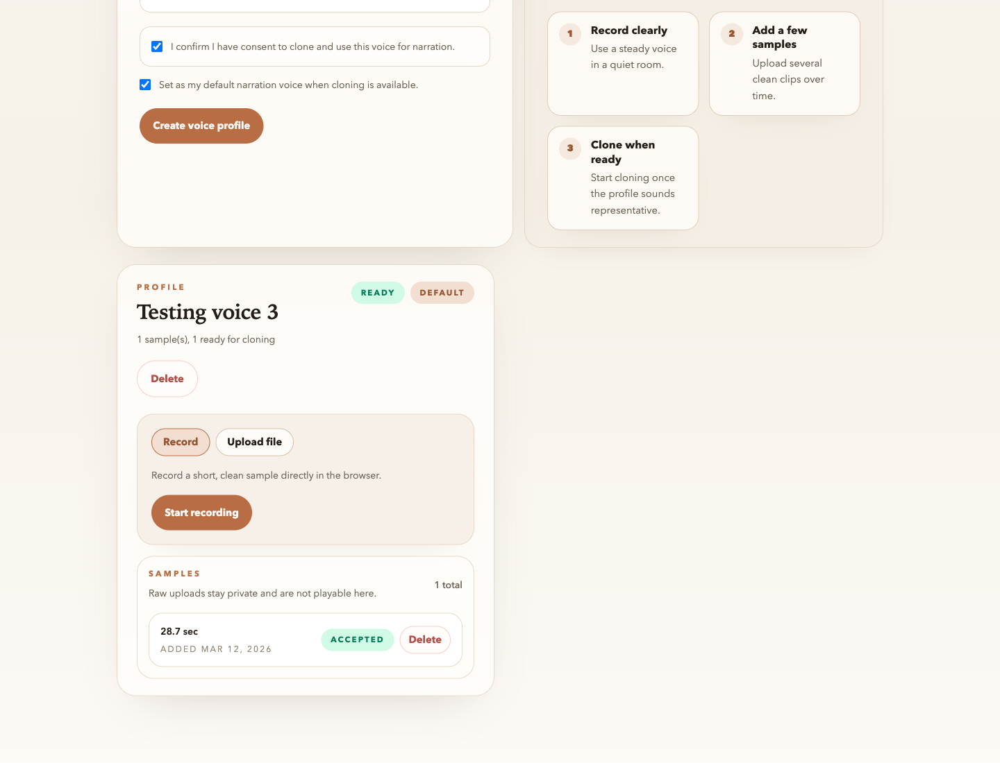
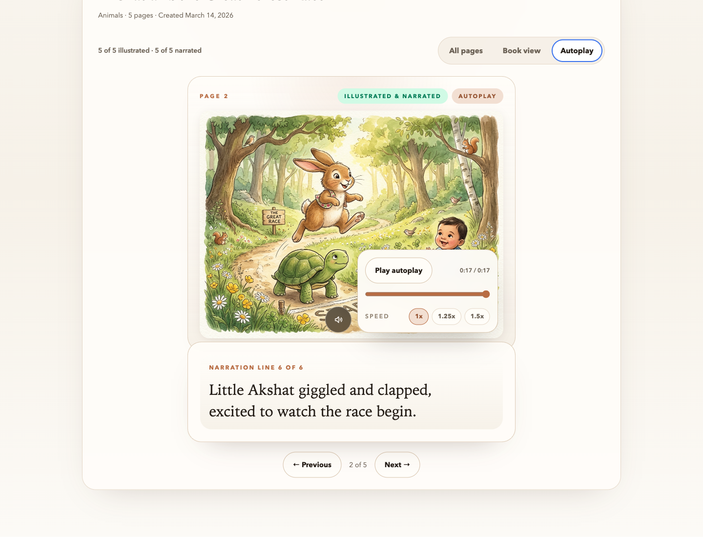

[Home](Home) | [Technical Approach](Technical-Approach) | [Privacy and Trust](Privacy-and-Trust)

# Product Tour

Vocaleaf is designed to feel warm and straightforward for a parent, even though the system behind it coordinates authentication, storage, generation pipelines, and narration playback. This page walks through the current product journey from sign-in to story playback.

## 1. Sign in and pick up where bedtime left off

The app opens with a calm, editorial sign-in flow that supports both email/password and Google sign-in. The product language already emphasizes the core promise: saved child profiles, reusable narration voices, and private story assets.

## 2. Create a story without wrestling with prompts

Story creation is structured instead of free-form. A parent chooses the child, shapes the prompt, picks an art style, selects the page count, and optionally attaches a ready narration voice. The request saves immediately and generation continues in the background.

## 3. Capture a reusable narration voice

Voice setup is built as its own product flow, not an afterthought. Parents create a voice profile, confirm consent, and add samples by recording in the browser or uploading files directly. The UI keeps the next step clear at each stage.

Once samples are accepted, the voice profile becomes available for future stories. This keeps narration reusable across the library instead of tying one voice upload to one story.

## 4. Read in a focused book view

Generated stories are stored page by page, with illustration and audio attached to each page. The reader view turns that structure into a calm, book-like experience with a large image surface, story text, and inline narration playback.

## 5. Let narration drive the experience

Autoplay turns the story into a guided bedtime mode. Narration and page pacing work together so the reading experience feels like a finished product, not just a generated asset list.

## Why this product shape matters

The product is not just trying to generate content. It is trying to make custom story creation feel trustworthy, repeatable, and easy enough that a parent would actually use it more than once.
